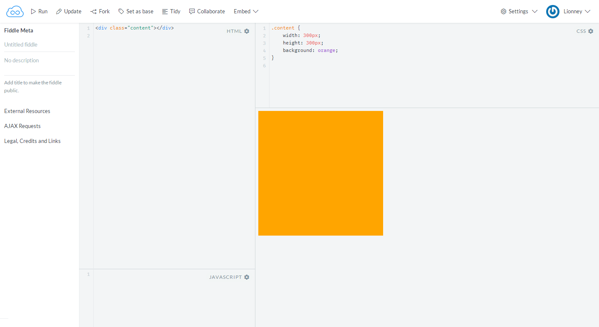
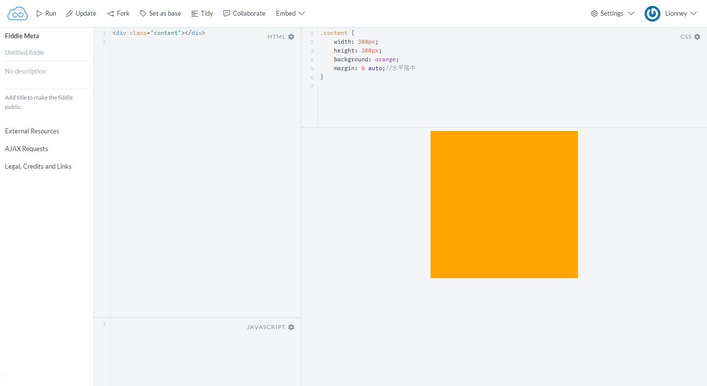
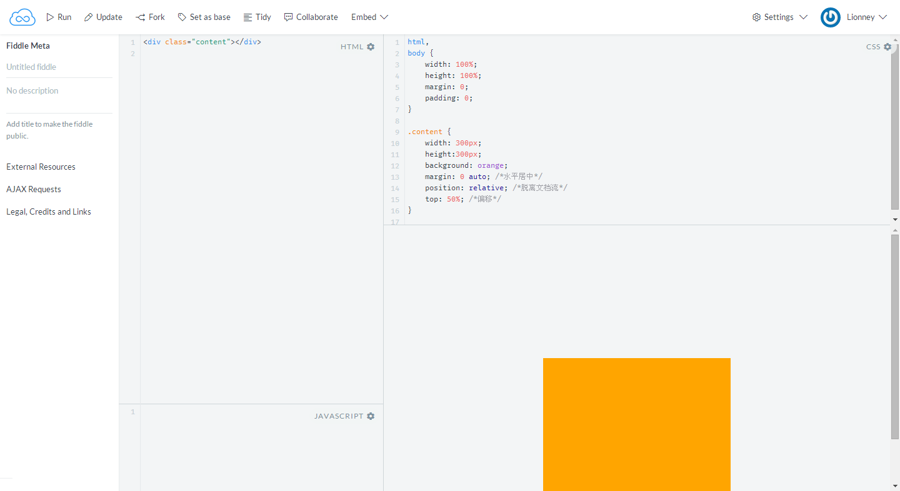

在前端开发过程中，盒子居中是常常用到的。

其中，居中又可以分为水平居中和垂直居中。

水平居中是比较容易的，直接设置元素的margin: 0 auto就可以实现。

但是垂直居中相对来说是比较复杂一些的。

下面我们一起来讨论一下实现垂直居中的方法。

首先，定义一个需要垂直居中的div元素，他的宽度和高度均为300px，背景色为橙色。代码如下：

```
<!DOCTYPE html>
<html lang="en">
<head>
    <meta charset="UTF-8">
    <title>index</title>
    <style>
        .content {
            width: 300px;
            height: 300px;
            background: orange;
        }
    </style>
</head>
<body>
    <div class="content"></div>
</body>
</html>
```

效果如下：



我们需要使得这个橙色的div居中，到底该怎么办呢？首先我们让实现水平居中，上面已经提到过了，可以通过设置margin: 0 auto实现水平居中，代码如下：

```
<!DOCTYPE html>
<html lang="en">
<head>
    <meta charset="UTF-8">
    <title>index</title>
    <style>
        .content {
            width: 300px;
            height: 300px;
            background: orange;
            margin: 0 auto;
        }
    </style>
</head>
<body>
    <div class="content"></div>
</body>
</html>
```

效果如下：




很好，已经实现水平居中了！接下来该打大boss了——实现垂直居中。

不过，在这之前，我们先要设置div元素的祖先元素html和body的高度为100%（因为他们默认是为0的），并且清除默认样式，即把margin和padding设置为0（如果不清除默认样式的话，浏览器就会出现滚动条，聪明的亲，自己想想问什么）。

```
<!DOCTYPE html>
<html lang="en">
<head>
    <meta charset="UTF-8">
    <title>index</title>
    <style>
        html, body {
            width: 100%;
            height: 100%;
            margin: 0; 
            padding: 0;
        }
        .content {
            width: 300px;
            height: 300px;
            background: orange;
            margin: 0 auto; /*水平居中*/
        }
    </style>
</head>
<body>
    <div class="content"></div>
</body>
</html>
```

接下来，我们需要做的事情就是要让div往下移动了。我们都知道top属性可以使得元素向下偏移的。但是，由于默认情况下，元素在文档流里是从上往下、从左到右布局的，我们是不可以直接通过top属性改变他的垂直偏移的。这就就需要使用position属性使它脱离文档流流了。这很简单，只要设置它的值为relative就行了。对于position属性不熟悉的，可以自己去w3c看一下。下面我们就让div脱离文档流:

```
<!DOCTYPE html>
<html lang="en">
<head>
    <meta charset="UTF-8">
    <title>index</title>
    <style>
        html, body {
            width: 100%;
            height: 100%;
            margin: 0;
            padding: 0;
        }
        .content {
            width: 300px;
            height: 300px;
            background: orange;
            margin: 0 auto; /*水平居中*/
            position: relative; /*脱离文档流*/
        }
    </style>
</head>
<body>
    <div class="content"></div>
</body>
</html>
```

我们刷新一下页面，发现跟之前是没有任何变化的，因为，我们仅仅是使div脱离了文档流，但是还没开始移动他的垂直偏移。好，下面我们就让它偏移吧！垂直偏移需要用到top属性，它的值可以是具体的像素，也可以是百分数。因为我们现在不知道父元素（即body）的具体高度，所以，是不可以通过具体像素来偏移的，而应该用百分数。既然是要让它居中嘛！好，那么我们就让它的值为50%不就行了吗？问题真的那么简单，我们来试一下，就设置50%试一下：

```
<!DOCTYPE html>
<html lang="en">
<head>
    <meta charset="UTF-8">
    <title>index</title>
    <style>
        html,body {
            width: 100%;
            height: 100%;
            margin: 0;
            padding: 0;
        }
        .content {
            width: 300px;
            height: 300px;
            background: orange;
            margin: 0 auto; /*水平居中*/
            position: relative; /*脱离文档流*/
            top: 50%; /*偏移*/
        }
    </style>
</head>
<body>
    <div class="content"></div>
</body>
</html>
```

效果如下图所示：



div垂直方向上面并没有居中。明显是偏下了。下面，我们在浏览器中间画一条红线用来参考，如下图：


通过观察上图，只要让div的中心移动到红线的位置，那么整个div就居中了。那怎么让它中心移动到红线处呢？从图中可以观察到，从div的中心到红线的距离是div自身高度的一半。这时候，我们可以使用通过margin-top属性来设置，因为div的自身高度是300，所以，需要设置他的margin-top值为-150。为什么是要设置成负数的呢？因为正数是向下偏移，我们是希望div向上偏移，所以应该是负数，如下：

```
<!DOCTYPE html>
<html lang="en">
<head>
    <meta charset="UTF-8">
    <title>index</title>
    <style>
        html,body {
            width: 100%;
            height: 100%;
            margin: 0;
            padding: 0;
        }
        .content {
            width: 300px;
            height: 300px;
            background: orange;
            margin: 0 auto; /*水平居中*/
            position: relative; /*脱离文档流*/
            top: 50%; /*偏移*/
            margin-top: -150px; 
        }
    </style>
</head>
<body>
    <div class="content"></div>
</body>
</html>
```

效果如下：


确实已经居中了。好兴奋！有木有？！

除了可以使用margin-top把div往上偏移之外，CSS3的transform属性也可以实现这个功能，通过设置div的transform: translateY(-50%)，意思是使得div向上平移（translate）自身高度的一半(50%)。如下：

```
<!DOCTYPE html>
<html lang="en">
<head>
    <meta charset="UTF-8">
    <title>index</title>
    <style>
        html,body {
            width: 100%;
            height: 100%;
            margin: 0;
            padding: 0;
        }
        .content {
            width: 300px;
            height: 300px;
            background: orange;
            margin: 0 auto; /*水平居中*/
            position: relative; /*脱离文档流*/
            top: 50%; /*偏移*/
            transform: translateY(-50%);
        }
    </style>
</head>
<body>
    <div class="content"></div>
</body>
</html>
```

效果如下：


上面的两种方法，我们都是基于设置div的top值为50%之后，再进行调整垂偏移量来实现居中的。如果使用CSS3的弹性布局（flex）的话，问题就会变得容易多了。使用CSS3的弹性布局很简单，只要设置父元素（这里是指body）的display的值为flex即可。具体代码如下，对代码不做过多的解释，如果想了解弹性布局的可以看阮一峰老师的博客http://www.ruanyifeng.com/blog/2015/07/flex-grammar.html：

```
<!DOCTYPE html>
<html lang="en">
<head>
    <meta charset="UTF-8">
    <title>index</title>
    <style>
        html,body {
            width: 100%;
            height: 100%;
            margin: 0;
            padding: 0;
        }

        body {
            display: flex;
            align-items: center; /*定义body的元素垂直居中*/
            justify-content: center; /*定义body的里的元素水平居中*/
        }
        .content {
            width: 300px;
            height: 300px;
            background: orange;        
        }
    </style>
</head>
<body>
    <div class="content"></div>
</body>
</html>
```

效果：


除了上面3中方法之外，当然可能还存在许多的可以实现垂直居中的方法。比如可以将父容器设置为display:table ，然后将子元素也就是要垂直居中显示的元素设置为 display:table-cell 。但是，这是不值得推荐的，因为会破坏整体的布局。如果用table布局，那么为什么不直接使用table标签了？那不更加方便吗？

[http://www.codeceo.com/article/css-vertical-align-center.html](http://www.codeceo.com/article/css-vertical-align-center.html)
